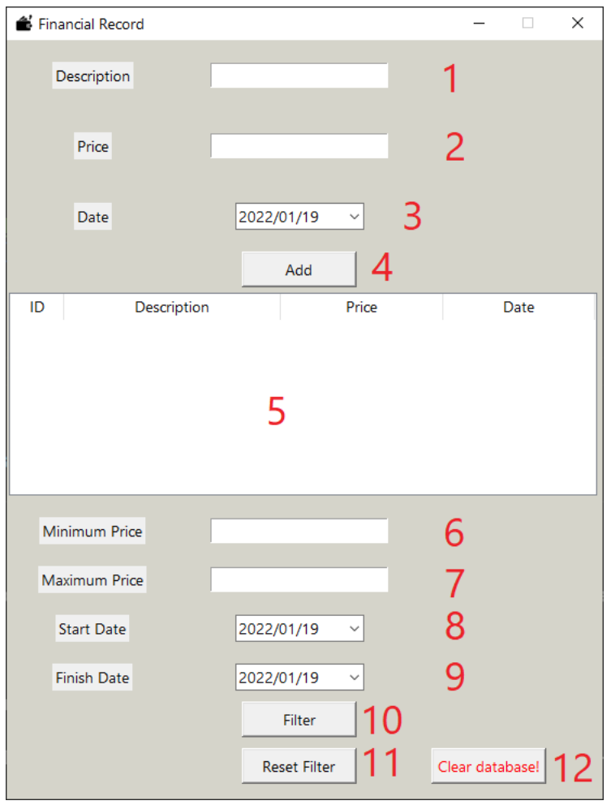
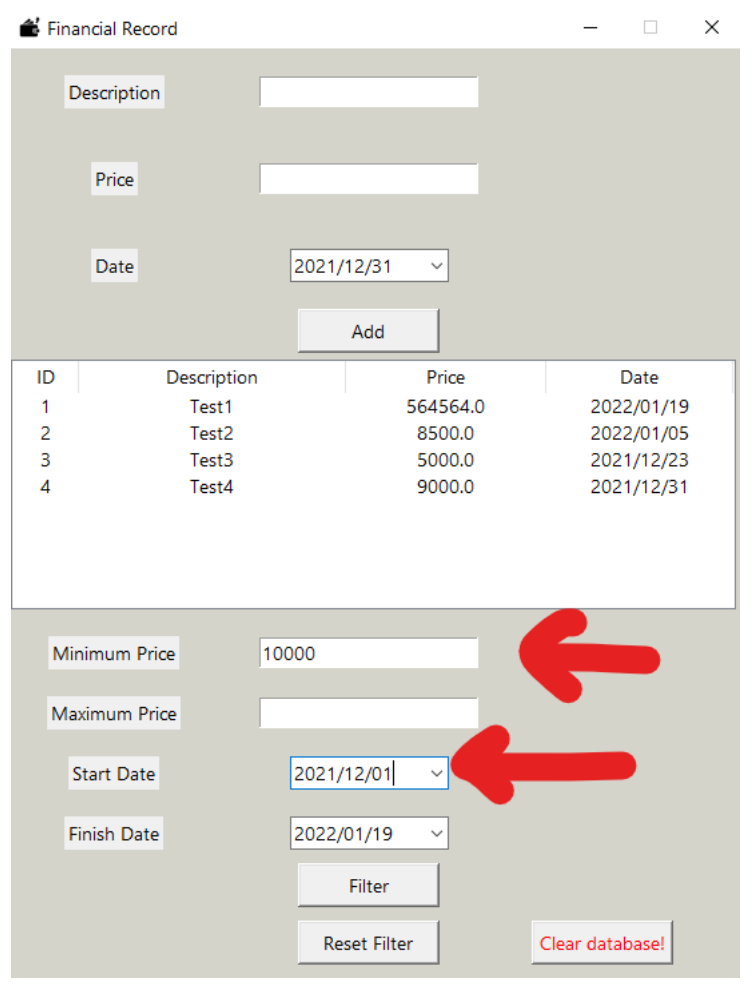

# Financial Tracker

A small desktop app to record and search financial transactions. Written in Python with a Tkinter GUI.

This was my first programming project, for the Fundamentals of Computer and Programming course (Fall 2021, first semester of my B.Sc.).

## What it does

- Add a transaction with a description, price and date
- Save all transactions in a text file and load them again when the program starts
- Show the transactions in a table
- Filter by minimum price, maximum price and date range
- Clear the whole database

## Input checks

- Description can't be empty and can't contain `^` (it is the separator in the file)
- Price must be a number (integer or decimal) and can't be negative
- Date can't be in the future
- Empty minimum price means 0, empty maximum price means infinity
- Errors are shown in red next to the input

## How data is stored

The "database" is just a text file (`DB.txt`). Each transaction is one line:

```
ID^ description^ price^ date
```

## Libraries

- `tkinter` and `tkinter.ttk` for the GUI and the table
- `tkcalendar` (DateEntry) for picking dates
- `datetime` for converting and comparing dates
- `os` for deleting the database file
- `cmath` for infinity in price comparison

## How to run

Tkinter comes with Python (on Linux you may need to install `python3-tk`).

```
pip install -r requirements.txt
python src/main.py
```

Run it from this folder, because `DB.txt` is created here.
To try it with sample data, copy `data/sample_DB.txt` to `DB.txt` first.

## Screenshots




## Known limitations

- Negative prices (income) are not supported. I didn't have enough time to add it.
- The calendar library has a small bug: sometimes you can't go to the next month, and changing the month a few times fixes it.

## Report

The full report (in Persian) is here: [report_fa.pdf](report/report_fa.pdf)
