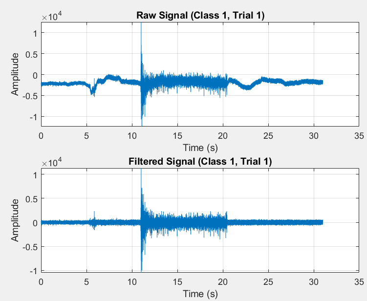
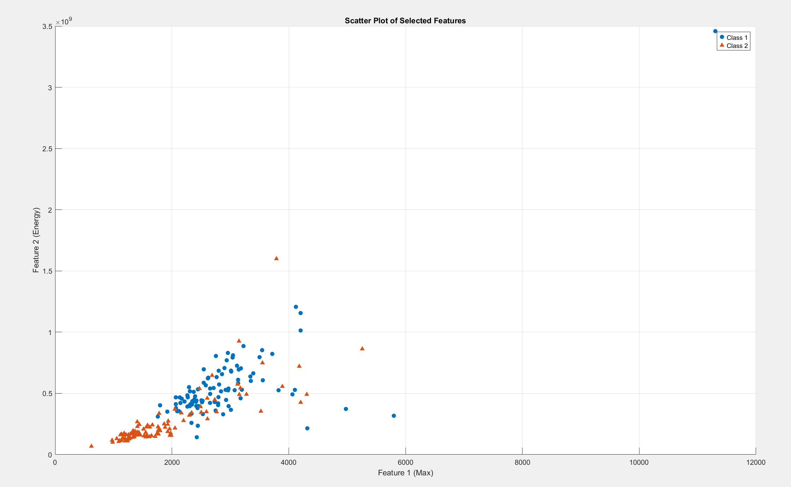
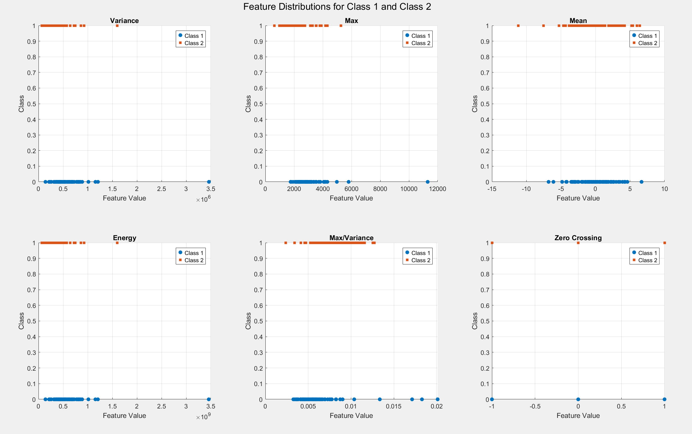
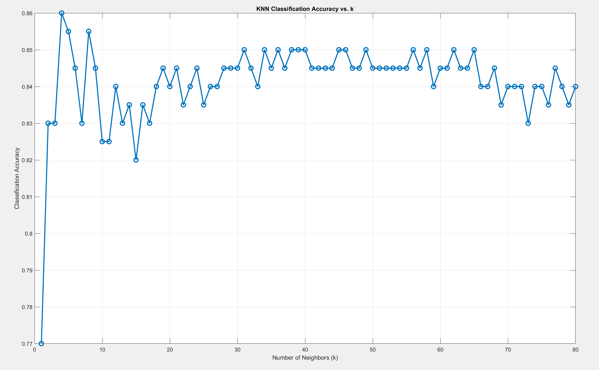

# EMG Signal Classification

> Note: This is one sample of the projects I did in the Biosignal Lab course. The other lab projects are not included in this repository.

A simple classification project: using EMG signals to tell whether a recording comes from the arm or the wrist. Written in MATLAB.

## Goal

Build a classifier that can tell if an EMG recording is from the arm or the wrist, without knowing where it was recorded.

## Data

- 2 classes (arm and wrist), 10 recordings for each class, 20 recordings in total
- Each recording is 31 seconds, sampled at 1000 Hz (31000 samples)
- Files are in `data/` and named `class_<class>_trial_<trial>.mat`. The signal is stored in the variable `ch`.

## What I did

1. **Filter:** Butterworth bandpass filter (order 2, 20 to 450 Hz) with `filtfilt`, then I removed the mean of each signal.
2. **Segments:** Muscle activity is only in the middle of each recording, so I kept the middle 10 seconds (samples 11001 to 21000) and cut it into ten 1-second signals. This gives 100 signals per class, 200 in total.
3. **Features:** I extracted 6 features: variance, max, mean, energy, max/variance and zero crossings. From the scatter plots, max and energy separated the two classes best, so I used these two.
4. **Classifier:** KNN written by myself with k = 7 and 5-fold cross-validation. Distance can be Euclidean, Manhattan or Minkowski (p = 3). I chose k from the accuracy vs k plot.
5. **Phase 2:** I compared my KNN with the MATLAB built-in KNN (`fitcknn`).

## Results

| Method | Accuracy |
|--------|----------|
| My KNN, Euclidean distance | 84.5% |
| My KNN, Manhattan distance | 85% |
| My KNN, Minkowski distance (p = 3) | 83% |
| MATLAB built-in KNN | 85% |

The folds are random, so results change a little each run. The difference between my KNN and the built-in one was about 1%.

## Requirements

MATLAB (R20xx) with these toolboxes:

- Signal Processing Toolbox (`butter`, `filtfilt`)
- Statistics and Machine Learning Toolbox (`fitcknn`, `crossval`)
- Bioinformatics Toolbox (`crossvalind`)

## How to run

Open MATLAB, set the current folder to this project folder and run:

```
addpath('src')
emg_classification
```

## Figures







## Report

The full report (in Persian) is here: [report_fa.pdf](report/report_fa.pdf)
