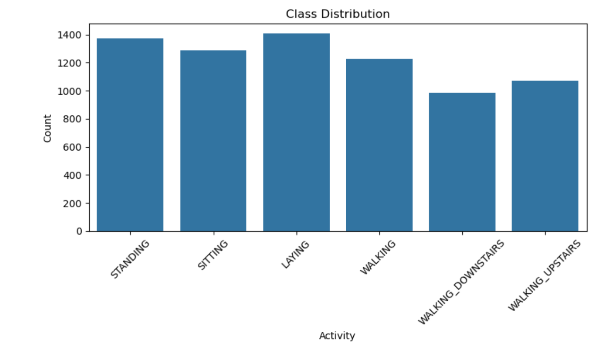
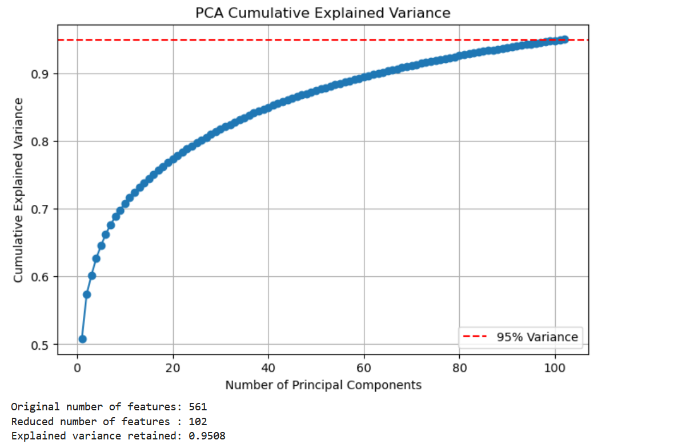
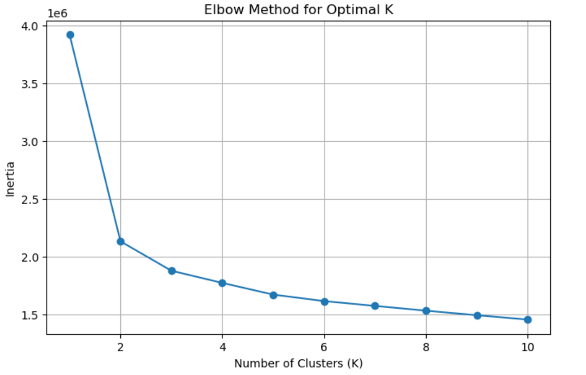
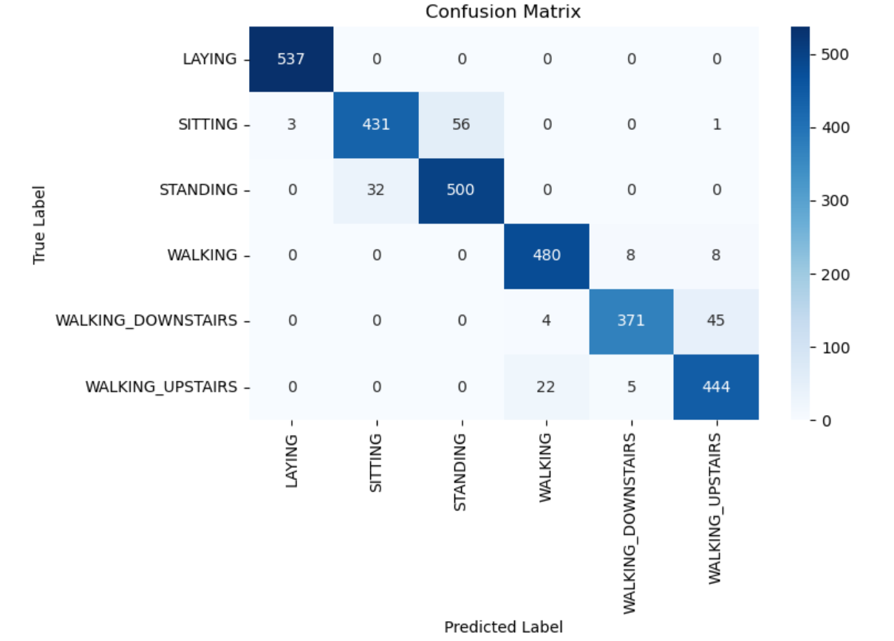
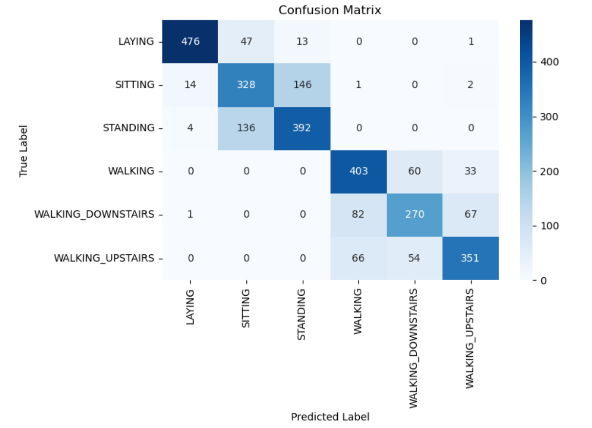

# Human Activity Recognition Using Smartphones

Final project of the Machine Learning course (Spring 2026). The goal is to recognize human activity from smartphone sensor data using PCA, clustering and classification. Written in Python (scikit-learn) in a Jupyter notebook.

## Data

The UCI "Human Activity Recognition Using Smartphones" dataset ([link](https://archive.ics.uci.edu/dataset/240/human+activity+recognition+using+smartphones)).

- 30 volunteers did 6 activities (walking, walking upstairs, walking downstairs, sitting, standing, laying) with a smartphone on their waist
- 561 features extracted from the accelerometer and gyroscope
- 7352 training samples and 2947 test samples. The split is by volunteer, so no volunteer is in both sets.

The data is not included in this repository. See `data/README.md`.

## What I did

**Part 1: EDA, preprocessing and PCA**
- No missing values, and the classes are roughly balanced
- Standardized the features (scaler fitted on train only)
- PCA to keep 95% of the variance: 561 features became 102

**Part 2: Unsupervised learning**
- K-Means and Gaussian Mixture Model (EM) on the PCA data, with 6 clusters
- Compared them with the real labels using ARI and NMI

**Part 3: Supervised learning**
- Trained 6 models with default parameters: Logistic Regression, Naive Bayes, KNN, Decision Tree, Random Forest and SVM
- Tuned Decision Tree and SVM with Grid Search and 5-fold cross-validation
- Compared accuracy, precision, recall, F1 (weighted), training time and prediction time
- Plotted the confusion matrix of every model

## Results

Clustering:

| Method | ARI | NMI |
|--------|-----|-----|
| K-Means | 0.4196 | 0.5588 |
| GMM | 0.3090 | 0.4905 |

Classification on the test set:

| Model | Accuracy | F1 |
|-------|----------|----|
| Logistic Regression | 93.08% | 93.06% |
| Naive Bayes | 80.45% | 80.20% |
| KNN | 87.68% | 87.62% |
| Decision Tree | 75.33% | 75.43% |
| Random Forest | 88.16% | 88.04% |
| SVM | 93.76% | 93.74% |
| Decision Tree (tuned) | 78.35% | 78.49% |
| **SVM (tuned)** | **94.10%** | **94.08%** |

Best parameters: Decision Tree `criterion=entropy, max_depth=None, min_samples_split=5`. SVM `kernel=rbf, C=10, gamma=scale`.

Main findings:
- Tuned SVM was the best model, but it is not the fastest. Tuning helped the Decision Tree a lot and the SVM only a little.
- Most errors are between sitting and standing, and between walking upstairs and walking downstairs. Their sensor patterns are very similar. Laying is almost always correct.
- K-Means matched the real activities better than GMM.

## Figures







## How to run

```
pip install -r requirements.txt
```

Put `train.csv` and `test.csv` in `data/` and open the notebook:

```
jupyter notebook src/har_activity_recognition.ipynb
```

The notebook also saves the PCA data as `HAR_PCA_train.csv` and `HAR_PCA_test.csv` next to it.

## Known limitations

- The elbow plot is not clear (the biggest drop is from K = 1 to K = 2). I used K = 6 because the data has 6 activities.
- Grid Search used normal 5-fold cross-validation, so samples from the same volunteer can be in both the training and validation folds.
- Running times were measured once, so they change a little from run to run.

## Report

The full report (in Persian) is here: [report_fa.pdf](report/report_fa.pdf)
