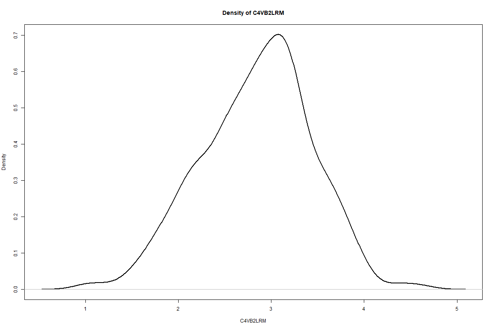
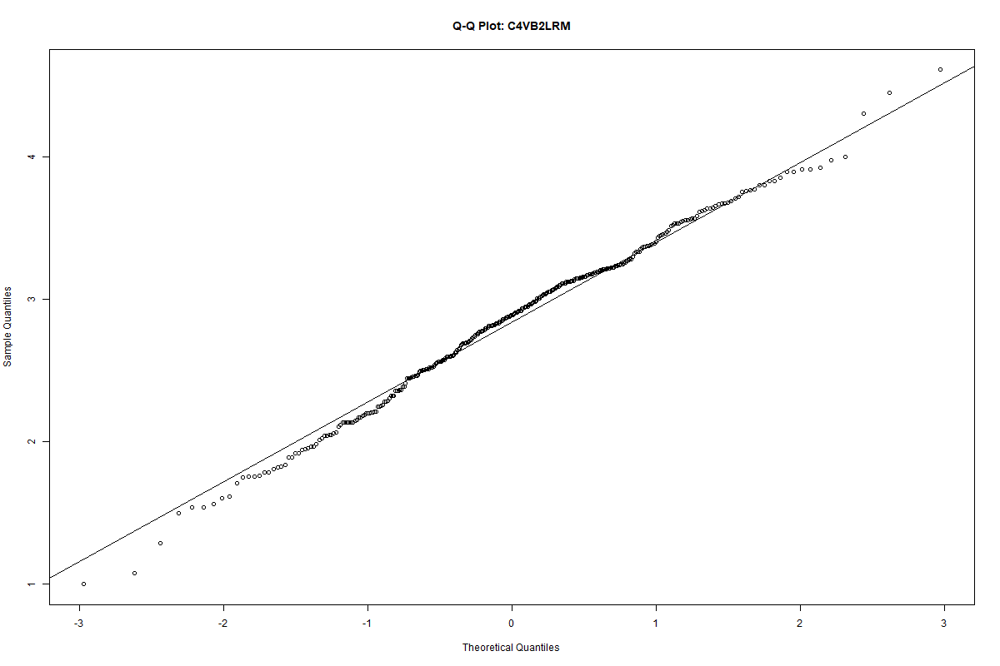
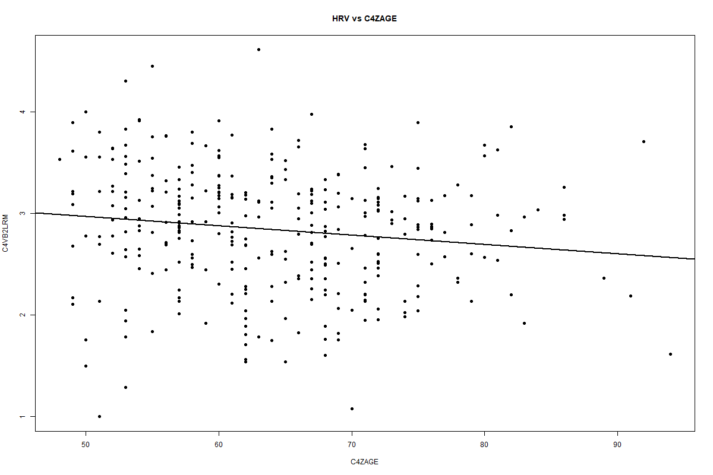
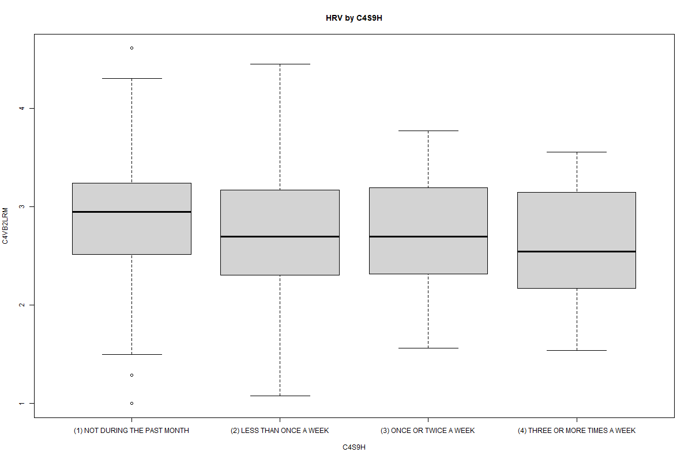
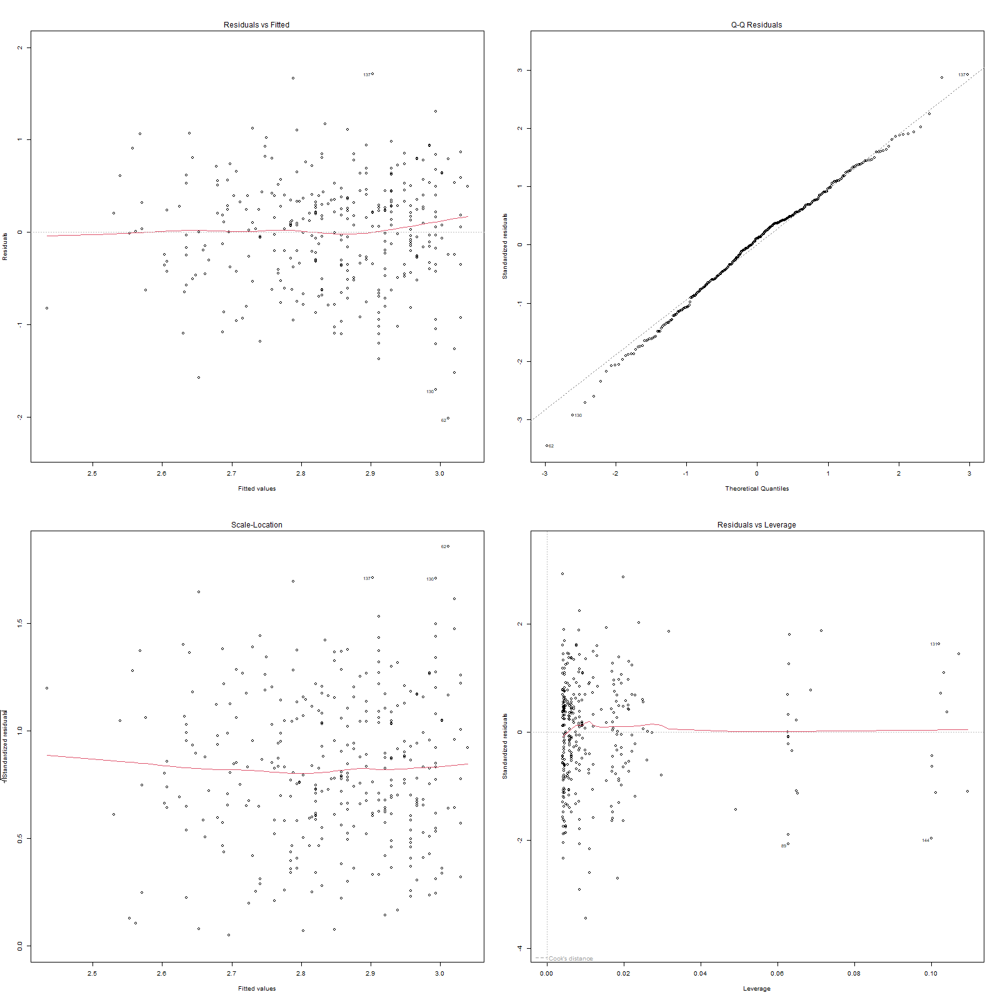
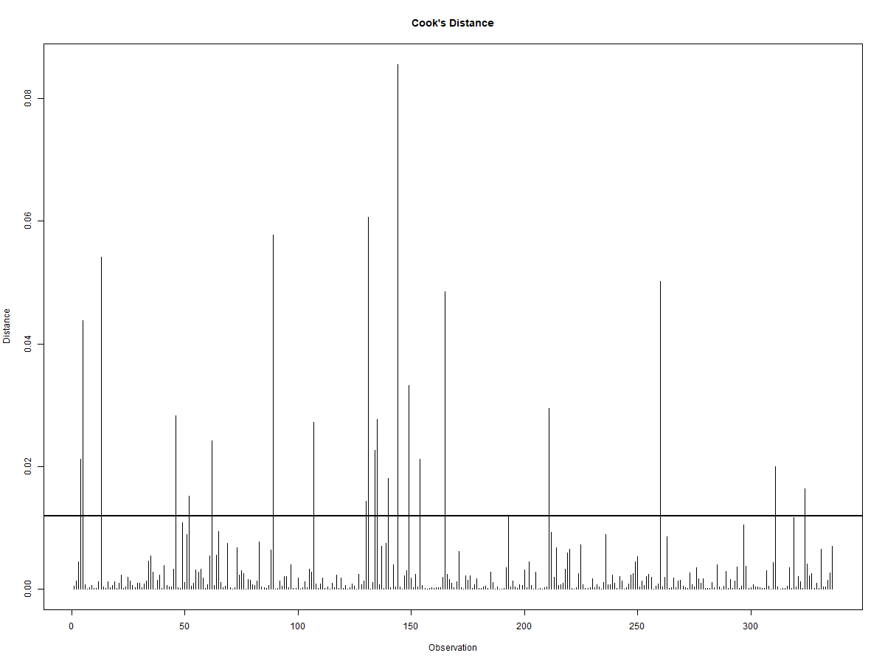

# Sleep, Demographics and Autonomic Nervous System Activity (HRV)

Final project of the Statistical Analysis of Biomedical Data course (Spring 2026). I studied how sleep characteristics and demographic factors are related to heart rate variability (HRV), which reflects autonomic nervous system activity. Written in R.

## Data

The MIDUS 3 Biomarker Project ([ICPSR 38837](https://doi.org/10.3886/ICPSR38837.v1)), a public dataset with 747 participants. The data are not included in this repository. See `data/README.md`.

This is multimodal data. It combines different kinds of measurements of the same people:

- **Physiological:** HRV recorded during the lab protocol
- **Self-reported:** sleep questionnaire items, alcohol use
- **Clinical:** body mass index
- **Demographic:** age and sex

The variables are also of different types (continuous, ordinal and binary), so I chose a different test for each type.

## Variables

| Role | Variables |
|------|-----------|
| Response | `C4VB2LRM`: natural log of RMSSD (baseline 2), an index of parasympathetic activity |
| Sleep | `C4S2` (time to fall asleep), `C4S4` (sleep duration), `C4S5`, `C4S7`, `C4S9A` to `C4S9J` (how often different sleep problems happen, for example `C4S9H` is bad dreams) |
| Controls | `C1PRSEX` (sex), `C4ZAGE` (age), `C4PBMI` (BMI), `C4H51` and `C4H1U` (alcohol use) |

## What I did

**1. Data cleaning**
- Started with 747 participants and 24 variables
- Removed 3 variables with more than 50% missing values (family alcohol history, `C4H75G1`, `C4H75G2`, `C4H75G4`)
- Kept only participants with complete data: **336 participants, 21 variables**

**2. Exploratory analysis and association tests** (one test for each variable type)

| Variable type | Test |
|---------------|------|
| Continuous (`C4S2`, `C4S4`, `C4ZAGE`, `C4PBMI`) | Pearson correlation |
| Ordinal (`C4S5`, `C4S7`, `C4S9A` to `C4S9J`, `C4H51`, `C4H1U`) | Spearman correlation |
| Binary (`C1PRSEX`) | t-test (R default, which is Welch) |

I also checked the distribution of the response with a density plot, a Q-Q plot and the Shapiro-Wilk test.

**3. Multiple linear regression**
- Full model with 19 predictors. Ordinal variables were used as factors.
- Backward elimination with AIC to get the final model

**4. Checking the assumptions of the final model**
- Normality of residuals: Shapiro-Wilk test and Q-Q plot
- Constant variance: Breusch-Pagan test and residuals vs fitted plot
- Multicollinearity: VIF
- Influential points: Cook's distance (cutoff 4/n)

## Results

Only two variables had a significant single-variable association with HRV: age (Pearson r = -0.142, p = 0.009) and `C4S9H`, bad dreams (Spearman rho = -0.141, p = 0.010). Sex was not significant (p = 0.937).

The full model was not significant (R² = 0.157, adjusted R² = 0.013, p = 0.326). Backward elimination kept two variables:

`C4VB2LRM ~ C4S9H + C4ZAGE`

| Term | Estimate | p-value |
|------|----------|---------|
| Intercept | 3.4747 | < 2e-16 |
| `C4S9H`: less than once a week | -0.1867 | 0.0286 |
| `C4S9H`: once or twice a week | -0.1707 | 0.260 |
| `C4S9H`: 3 or more times a week | -0.2542 | 0.180 |
| `C4ZAGE` (per year) | -0.00908 | 0.00984 |

Model fit: R² = 0.040, adjusted R² = 0.029, F = 3.46, p = 0.0087, n = 336.

Assumption checks:

| Check | Result |
|-------|--------|
| Shapiro-Wilk (residuals) | W = 0.993, p = 0.106 |
| Breusch-Pagan | BP = 4.50, p = 0.343 |
| VIF | about 1.00 for both variables |
| Cook's distance | largest value about 0.09 |

Main findings:
- HRV decreases with age, about 0.009 log units per year.
- People who had bad dreams less than once a week had lower HRV than people who had none in the past month. The groups with more frequent bad dreams had only 16 and 10 people and were not significant.
- The final model explains only about 3% of the variation in HRV.

## Figures








## Limitations

- The effects are small. The model explains about 3% of the variance.
- I used only complete cases, so 411 of 747 participants were dropped. Most of this comes from the response (26.5% missing) and from `C4H51` (38.6% missing, it stayed because my cutoff was 40%). I did not compare the dropped and kept participants.
- I ran 19 single-variable tests without correcting for multiple testing (with a Bonferroni correction none of them would be significant). The p-values of the final model are also optimistic because the variables were chosen by backward elimination.
- For bad dreams, the overall test of the variable was not significant (p = 0.071). Only one level was significant, so I see this as a weak result.
- This is observational data, so the results show association, not cause. Participants may not be fully independent (MIDUS includes twins), and medications that affect HRV were not controlled for.

## How to run

Get the data as described in `data/README.md`, install the packages and run the script from this folder:

```r
install.packages(c("tidyverse", "car", "lmtest", "lm.beta"))
source("src/sleep_hrv_analysis.R")
```

The plots are saved in the `Images/` folder.

## Report

The full report (in Persian) is here: [report_fa.pdf](report/report_fa.pdf)

## Data source

Ryff, C. D., Seeman, T. E., & Weinstein, M. (2023). Midlife in the United States (MIDUS 3): Biomarker Project, 2017-2022 [Dataset]. ICPSR38837.v1. https://doi.org/10.3886/ICPSR38837.v1
